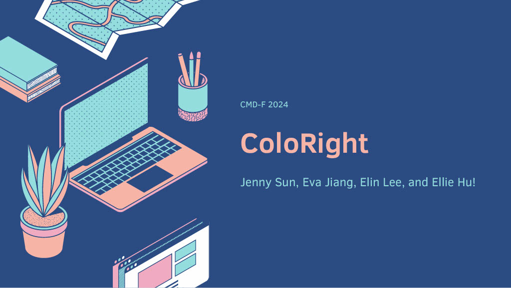
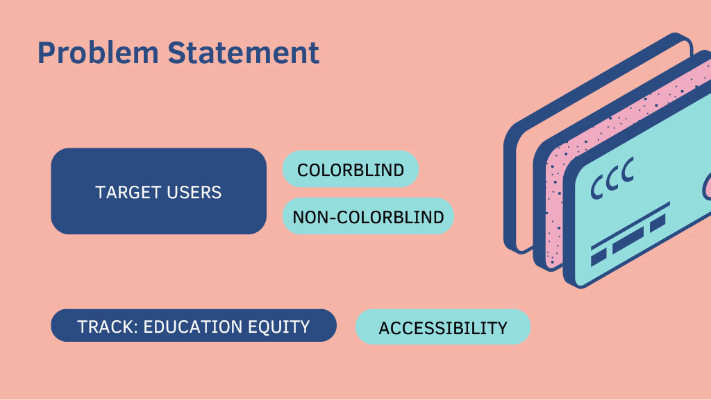
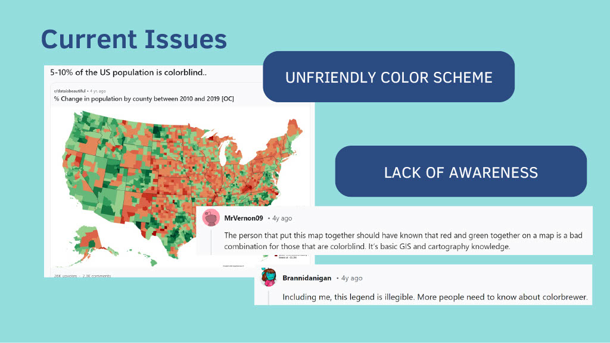
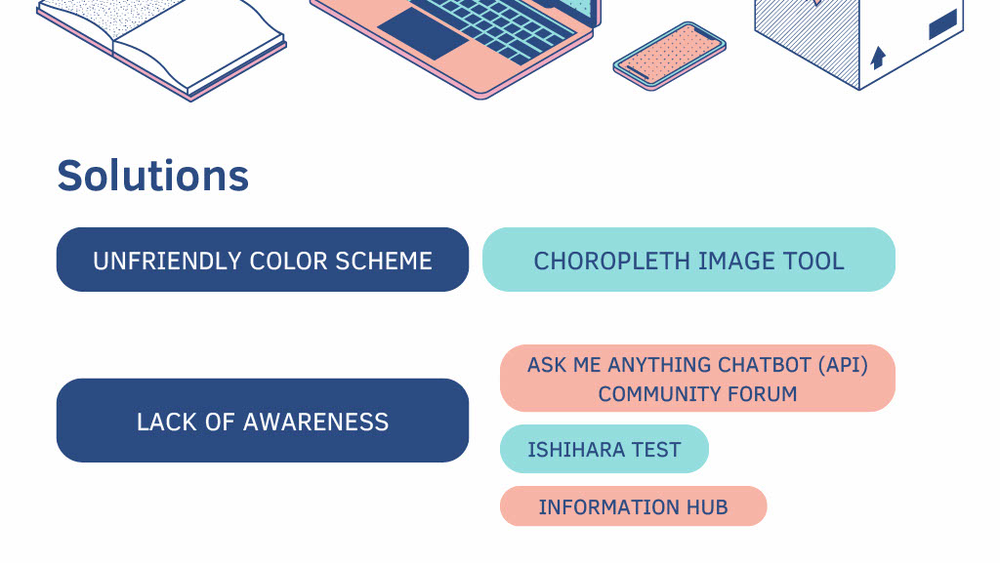
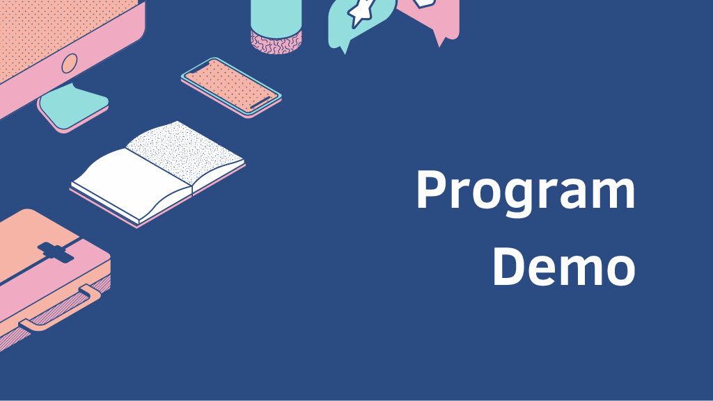
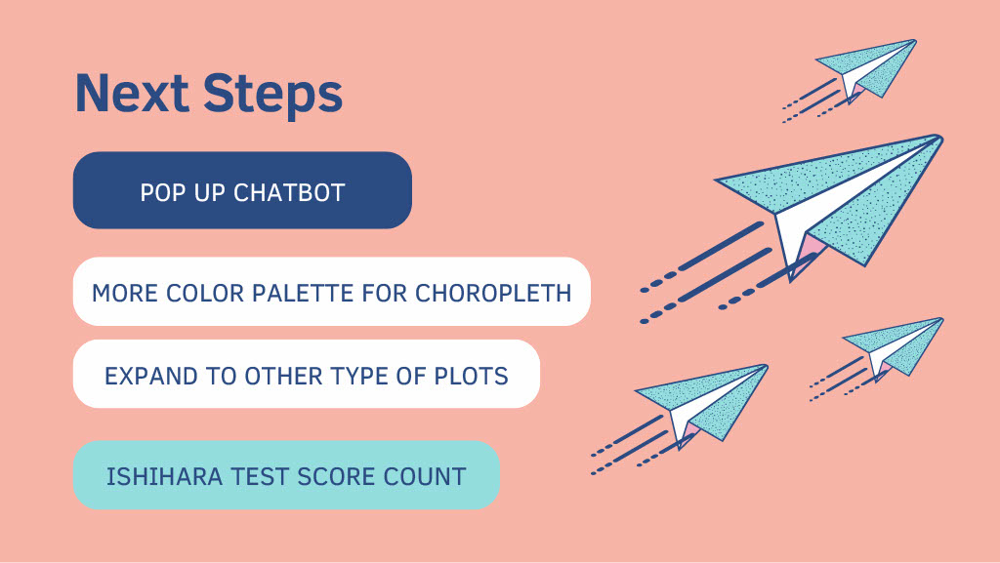
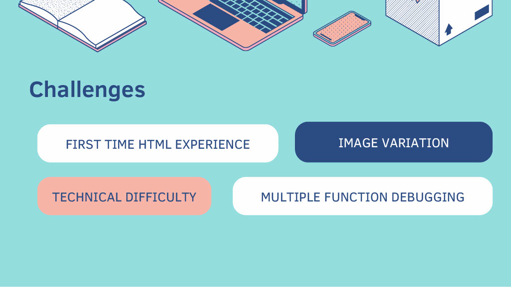
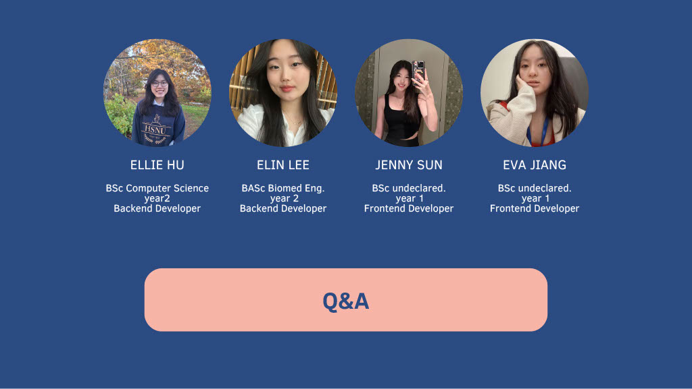

## Inspiration
Colourblindness is a real-world experience. Despite being a condition experienced by around 300 million people, there are widespread misconceptions regarding the condition. This results in low awareness and potential difficulties for individuals who experience colorblindness.

## What it does
Coloright provides an informational, educational, and interactive experience to users who wish to learn more about colorblindness. It targets misinformation and misconceptions regarding colorblindness by providing accurate education. Resources are also provided for individuals who may experience colorblindness, such as news articles, blog posts, videos, or other informational websites.

## How we built it
### Technology Stack:

Version control:
- GitHub for version control
- Git for local repository management
- Git Repository for collaborative development

Frontend:
- HTML for web structure
- CSS for styling

Backend:
- Python for image processing for choropleth maps
- Javascript for Ishihara test
- Cohere API for the chatbot
- Flask for connecting the frontend and backend
  
## Challenges we ran into
We had difficulty with the following:
- Making the computer detect the color bar of the different images
- Importing one image at a time (per page) with the separate next and submit buttons

## Accomplishments that we're proud of
Despite external issues resulting in less time for actual hacking, we were able to create a fully interactive site with a fully functional backend within 24 hours. We were also able to fully learn and incorporate a new tool, Cohere API, in a manner that was relevant to the topic of education and accessibility.

## What we learned
We learned how to use GIt and Github for version control to work as a team, which was extremely vital for the hackathon. We also learned how to use Cohere API to create a fully functional chatbot which guided users to relevant resources for colorblindness education.

## What's next for Coloright
- Implementing a popup chatbot, rather than a chatbot which opens on another page.
- Score count for Ishihara test in order to make it more engaging and allow users to keep track of their progress.
- Addressing different types of colorblindness, more than just deuteranopia in order to improve inclusivity for all individuals who experience colorblindness.

## Built With
- api
- css
- flask
- git/github
- html
- javascript
- python
- visual-studio-code

## Demo video

## Presentation slides

  

  

  

  

  

  

  

  

